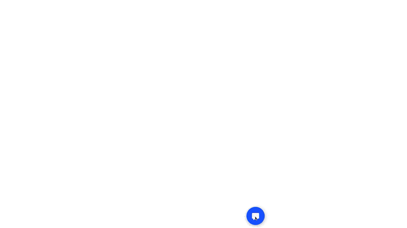

<p align="center">

<a href="https://www.npmjs.com/package/botfront">
    
</a>
<a href='https://github.com/botfront/botfront/blob/master/LICENSE'>
    
</a>
<a href='https://spectrum.chat/botfront'>
    
</a>
</p>
<h1 align="center">Rasa Webchat 💬</h1>
<h5 align="center">
 A chat widget to deploy virtual assistants made with <a href="https://github.com/rasaHQ/rasa">Rasa</a> or <a href="https://github.com/botfront/botfront?utm_source=rasa_webchat">Botfront</a> on any website.
</h5>
<br />
<br />

<div align="center">

</div>

## Features
- Text Messages
- Quick Replies
- Images
- Carousels
- Markdown support
- Persistent sessions
- Typing indications
- Smart delay between messages
- Easy to import in a script tag or as a React Component

## 🔥 Promo: check out our other cool open source project

<a href="https://github.com/botfront/botfront?utm_source=rasa_webchat">

</a>


## Usage

### In a `<script>` tag

In your `<body/>`:
```html
<script>!(function () {
  let e = document.createElement("script"),
    t = document.head || document.getElementsByTagName("head")[0];
  (e.src =
    "https://cdn.jsdelivr.net/npm/rasa-webchat/lib/index.js"),
    (e.async = !0),
    (e.onload = () => {
      window.WebChat.default(
        {
          customData: { language: "en" },
          socketUrl: "https://bf-botfront.development.agents.botfront.cloud",
          // add other props here
        },
        null
      );
    }),
    t.insertBefore(e, t.firstChild);
})();
</script>
```

⚠️ We recommend adding a version tag to prevent breaking changes from major versions, e.g for version 1.0.0 https://cdn.jsdelivr.net/npm/rasa-webchat@1.0.0/lib/index.js,
however this will not work with versions below 1.0.0. If you do not specify a version, you will get served the latest available version of the rasa-webchat.

About images: `width` and `height` define the size in pixels that images in messages are crop-scaled to. If not present, the image will scale to the maximum width of the container and the image.

### As a React component

Install the [npm package](https://npmjs.com/rasa-webchat):
```bash
npm install rasa-webchat
```

Then:

```javascript
import Widget from 'rasa-webchat';

function CustomWidget = () => {
  return (
    <Widget
      initPayload={"/get_started"}
      socketUrl={"http://localhost:5500"}
      socketPath={"/socket.io/"}
      customData={{"language": "en"}} // arbitrary custom data. Stay minimal as this will be added to the socket
      title={"Title"}
    />
  )
}
```

- Make sure to have the prop `embedded`
set to `true` if you don't want to see the launcher.


## Parameters
| Prop / Param                 | Default value          | Description                                                                                                                                                                                                                                                                                                                                                                                                                                                                                                                  |
|------------------------|--------------------|------------------------------------------------------------------------------------------------------------------------------------------------------------------------------------------------------------------------------------------------------------------------------------------------------------------------------------------------------------------------------------------------------------------------------------------------------------------------------------------------------------------------------|
| `initPayload`          | `null`             | Payload sent to Rasa when conversation starts                                                                                                                                                                                                                                                                                                                                                                                                                                                                                |
| `socketUrl`            | `null`             | Socket URL                                                                                                                                                                                                                                                                                                                                                                                                                                                                                                                   |
| `socketPath`           | `null`             | Close the chat window                                                                                                                                                                                                                                                                                                                                                                                                                                                                                                        |
| `customData`           | `null`             | Arbitrary object sent with the socket. If using with Botfront, it must include the language (e.g. `{"language": "en"}`)                                                                                                                                                                                                                                                                                                                                                                                                      |
| `docViewer`            | `false`            | If you add this prop to the component or to the init script, `docViewer=true` , this will treat links in received messages as links to a document ( `.pdf .doc .xlsx` etc. ) and will open them in a popup using `https://docs.google.com/viewer` service                                                                                                                                                                                                                                                                    |
| `title`                | `'Welcome"`        | Title shown in the header of the widget                                                                                                                                                                                                                                                                                                                                                                                                                                                                                      |
| `subtitle`             | `null`             | Subtitle shown under the title in the header of the widget                                                                                                                                                                                                                                                                                                                                                                                                                                                                   |
| `inputTextFieldHint`   | `"Type a message"` | User message input field placeholder                                                                                                                                                                                                                                                                                                                                                                                                                                                                                         |
| `hideWhenNotConnected` | `true`             | If `true` the widget will hide when the connection to the socket is lost                                                                                                                                                                                                                                                                                                                                                                                                                                                     |
| `connectOn`            | `"mount"`          | This prop lets you choose when the widget will try connecting to the server. By default, it tries connecting as soon as it mounts. If you select `connectOn='open'` it will only attempt connection when the widget is opened. it can only take the values `mount` and `open`.                                                                                                                                                                                                                                               |
| `onSocketEvent`        | `null`             | call custom code on a specific socket event                                                                                                                                                                                                                                                                                                                                                                                                                                                                                  |
| `embedded`             | `false`            | Set to `true` if you want to embed the in a web page. The widget will always be open and the `initPayload` will be triggered immediately                                                                                                                                                                                                                                                                                                                                                                                     |
| `showFullScreenButton` | `false`            | Show a full screen toggle                                                                                                                                                                                                                                                                                                                                                                                                                                                                                                    |
| `displayUnreadCount`   | `false`            | Path to an image displayed on the launcher when the widget is closed                                                                                                                                                                                                                                                                                                                                                                                                                                                         |
| `showMessageDate`      | `false`            | Show message date. Can be overriden with a function: `(timestamp, message) => return 'my custom date'`                                                                                                                                                                                                                                                                                                                                                                                                                       |
| `customMessageDelay`   | See below          | This prop is a function, the function take a message string as an argument. The defined function will be called everytime a message is received and the returned value will be used as a milliseconds delay before displaying a new message.                                                                                                                                                                                                                                                                                 |
| `params`               | See below          | Essentially used to customize the image size, also used to change storage options.                                                                                                                                                                                                                                                                                                                                                                                                                                                                                |
| `storage`              | `"local"`          | ⚠️ This is not a prop, it has to be passed inside the params object above. <br> Specifies the storage location of the conversation state in the browser. `"session"` defines the state to be stored in the session storage. The session storage persists on reload of the page, and is cleared after the browser or tab is closed, or when `sessionStorage.clear()`is called. `"local"` defines the state to be stored in the local stoage. The local storage persists after the the browser is closed, and is cleared when the cookies of the browser are cleared, or when `localStorage.clear()`is called. |
| `customComponent`      | `null`             | Custom component to be used with custom responses. E.g.: `customComponent={ (messageData) => (<div>Custom React component</div>)}`. Please note that this can only be used if you call the webchat from a React application as you can't write a component in pure Javscript. |
| `onWidgetEvent`        | `{}`             | call custom code on a specific widget event ( `onChatOpen`, `onChatClose`, `onChatHidden`, are available for now ), add a function to the desired object property in the props to have it react to the event. |

### Additional Examples

##### `customMessageDelay`
```javascript
(message) => {
    let delay = message.length * 30;
    if (delay > 2 * 1000) delay = 3 * 1000;
    if (delay < 400) delay = 1000;
    return delay;
}
```

##### `onSocketEvent`
```jsx
onSocketEvent={{
  'bot_uttered': () => console.log('the bot said something'),
  'connect': () => console.log('connection established'),
  'disconnect': () => doSomeCleanup(),
}}
```

##### `params`

The `params` props only allows to specify custom image dimensions:
```jsx
params={{
        images: {
          dims: {
            width: 300,
            height: 200
          }
        }
      }}
```

### Other features

#### Tooltips

Text messages received when the widget is closed will be shown as a tooltip.

#### Sending a message on page load

When reconnecting to an existing chat session, the bot will send a message contained in the localStorage key specified by the `NEXT_MESSAGE` constant. The message should be stringified JSON with a `message` property describing the message and an `expiry` property set to a UNIX timestamp in milliseconds after which this message should not be sent. This is useful if you would like your bot to be able to offer your user to navigate around the site.

#### Sending a payload from your React app

```jsx
function myComponent() {
    const webchatRef = useRef(null);
    
    // triggered when something happens in your app
    function callback() {
        if (webchatRef.current && webchatRef.current.sendMessage) {
            webchatRef.current.sendMessage('/myIntent{"entityName":"value"}');
        }
    }
    
    return <RasaWebchat
        ref={webchatRef}
    />;
}
```

The payload can be any message that the user would normally send, but if you want to force an intent and maybe some entities, you can use that format
`/myIntent{"entity1":"value1","entity2":"value2"}`

### Backends

The widget can be used with any backend but is primarily designed to be used with [Rasa](https://github.com/rasaHQ/rasa) or [Botfront](https://github.com/botfront/botfront).

#### Rasa

Use the `socketio` channel: See [instructions in the Rasa documentation](https://rasa.com/docs/core/connectors/#socketio-connector)

If you want to process `customData` in Rasa  you have to [create a new channel](https://rasa.com/docs/core/connectors/#custom-channels). Use channel `rasa_core.channels.socketio` as a template for your new channel. In this channel, `customData` can be retrieved via `data['customData']`. Then you can  modify `sender_id`, save `customData` to the database, fill slots or whatever you need to with your additional data.


#### Botfront

The Rasa Webchat is developped by the [Botfront](https://botfront.io) team and it works with Botfront. If your bot is multilingual, make sure to specificy the current language in the `customData` prop. E.g. `customData={{language: 'en'}}`. See in [Botfront docs](https://botfront.io/docs/channels/webchat/) for more details.


## Styles

From version 0.8 we started prefixing all css classes, if you already had css styling for the widget, just prepend `rw-` to all the classes you changed.

hierarchy:
```
.rw-conversation-container
  |-- .rw-header
        |-- .rw-title
        |-- .rw-close-function
        |-- .rw-loading
  |-- .rw-messages-container
        |-- .rw-message
              |-- .rw-client
              |-- .rw-response
        |-- .rw-replies
              |-- .rw-reply
              |-- .rw-response
        |-- .rw-snippet
              |-- .rw-snippet-title
              |-- .rw-snippet-details
              |-- .rw-link
        |-- .rw-imageFrame
        |-- .rw-videoFrame
  |-- .rw-sender
        |-- .rw-new-message
        |-- .rw-send
```

| Class                   |  Description                                                        |
|-------------------------|---------------------------------------------------------------------|
| .rw-widget-container       | The div containing the chatbox of the default version               |
| .rw-widget-embedded        | div of the embedded chatbox (using embedded prop)                   |
| .rw-full-screen            | div of the fullscreen chatbox (using fullScreenMode prop)           |
| .rw-conversation-container | the parent div containing the header, message-container and sender  |
| .rw-messages-container     | the central area where the messages appear                          |
| .rw-sender                 | div of the bottom area which prompts user input                     |
| .rw-new-message            | the text input element of sender                                    |
| .rw-send                   | the send icon element of sender                                     |
| .rw-header                 | div of the top area with the chatbox header                         |
| .rw-title                  | the title element of the header                                     |
| .rw-close-button           | the close icon of the header                                        |
| .rw-loading                | the loading status element of the header                            |
| .rw-message                | the boxes holding the messages of client and response               |
| .rw-replies                | the area that gives quick reply options                             |
| .rw-snippet                | a component for describing links                                    |
| .rw-imageFrame             | a container for sending images                                      |
| .rw-videoFrame             | a container for sending video                                       |


## Contributors
[@PHLF](https://github.com/phlf)
[@znat](https://github.com/znat)
[@TheoTomalty](https://github.com/TheoTomalty)
[@Hub4IT](https://github.com/Hub4IT)
[@dliuproduction](https://github.com/dliuproduction)
[@MatthieuJnon](https://github.com/MatthieuJnon)
[@mofortin](https://github.com/mofortin)
[@GuillaumeTech](https://github.com/GuillaumeTech)
                                 
<br/>
<h2 align="center">License</h2>

Copyright (C) 2021 Dialogue Technologies Inc.

Licensed under the Apache License, Version 2.0 (the "License");
you may not use this file except in compliance with the License.
You may obtain a copy of the License at

    http://www.apache.org/licenses/LICENSE-2.0

Unless required by applicable law or agreed to in writing, software
distributed under the License is distributed on an "AS IS" BASIS,
WITHOUT WARRANTIES OR CONDITIONS OF ANY KIND, either express or implied.
See the License for the specific language governing permissions and
limitations under the License.(C) 2021 Dialogue Technologies Inc. All rights reserved.